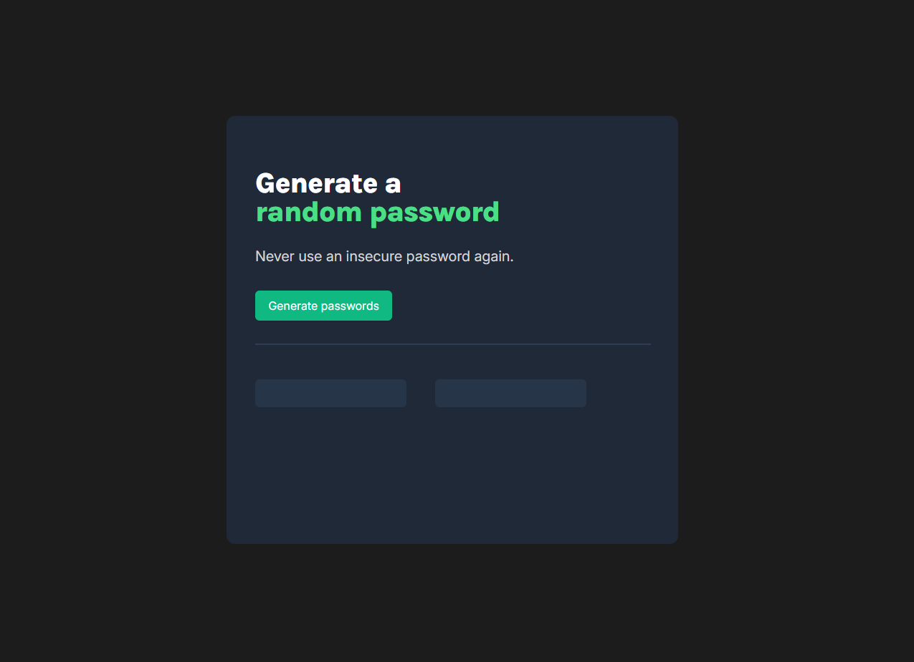

# Project: Password Generator

## Description
This project was created as part of the *Frontend Developer Career Path* on Scrimba.  
It is a simple web application that generates two random secure passwords with a single click.  
Each generated password is composed of random characters, numbers, and symbols.  
Users can also click on a generated password to automatically copy it to the clipboard.  

---

## Features
- Generate two random passwords at once.
- Passwords include letters, numbers, and symbols.
- Copy password to clipboard with a single click.
- Responsive dark-themed layout with hover effects.
- Clean design inspired by modern password manager interfaces.

---

## Technologies Used
- HTML5
- CSS3 (Flexbox, transitions, color variables)
- JavaScript (DOM manipulation, event listeners, random generation, clipboard API)
- Google Fonts (Inter, Karla)

---

## Project Structure
project-password-generator/
├── index.html
├── index.css
├── index.js
└── media/
└── preview.png

---

## Screenshot

---

## What I Learned
- How to use JavaScript arrays and `Math.random()` for random value generation.
- How to add click event listeners to HTML elements.
- How to update elements dynamically with `.textContent`.
- How to use the Clipboard API to copy text programmatically.
- How to build a clean and responsive layout with CSS Flexbox.

---

## Demo
GitHub Pages: https://caterinada.github.io/project-password-generator/

---

## Author
Caterina De Ambrosis  
Frontend Developer Student – Aulab & Scrimba  
GitHub: https://github.com/CaterinaDA
